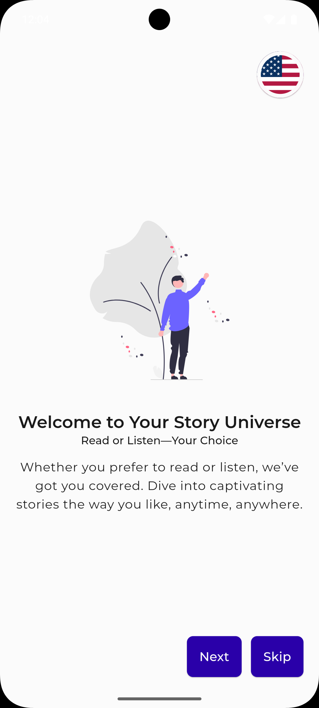

# Penta Story

Penta Story is a story book app. Users can read stories and listen to them.

## Setup

#### Clone the repository

```bash
git clone https://github.com/ANILSRGT/flutter_penta_story.git
```

#### Install dependencies

```bash
flutter pub get
```

#### [Firebase](https://console.firebase.google.com/) setup

1.  Create a new project in Firebase
2.  Add an Android app (com.pentaio_example.penta_story) to the project with FirebaseCLI

## Screen Shots

<div align=center>
    
    
    
    
    
    
    
    
    
    
    
    
    
    
    
    
</div>
